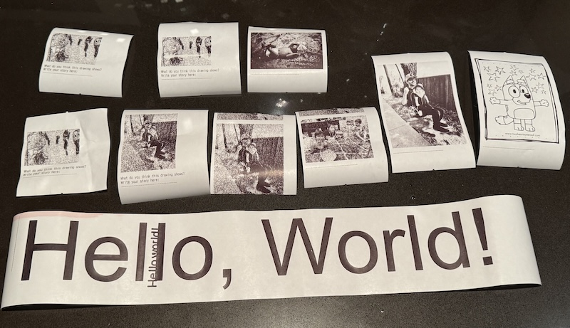

# Receipt Printer API



This is a FastAPI-based HTTP API that accepts image uploads and prints them to a thermal receipt printer (e.g. Rongta RP326).  
Supports both real printer output and dummy mode for testing and development.

## Requirements

- Python 3.11+
- [`uv`](https://github.com/astral-sh/uv) for Python dependency and environment management
- `pyserial` (required only for real serial printing)
- `cloudflared` (optional, for public HTTPS exposure)

## Setup Instructions

### 1. Clone the repo and set up the environment

```bash
git clone https://github.com/yourname/receipt-printer.git
cd receipt-printer

# Create isolated virtual environment
uv venv
source .venv/bin/activate

# Install dependencies from lockfile
uv pip sync uv.lock
```

### 2. To regenerate the lockfile (optional)

```bash
make lock
```

This reads from `requirements.in` and creates a new `uv.lock`.

## Running the Server

### Run with dummy printer (no hardware required)

```bash
make run-dummy
```

This will render ESC/POS output to `output.escpos`.

### Run with real printer (e.g. /dev/usb/lp0)

```bash
make run-real
```

If `pyserial` is not installed, do:

```bash
uv pip install pyserial
make lock
```

## Printing an Image

Use `curl` to send a file to the `/print` endpoint:

```bash
curl -X POST http://localhost:8000/print \
  -F "file=@drawing.jpg"
```

## Testing

```bash
make test
```

Tests cover both dummy and mocked real printer modes.

## Public Exposure (Optional)

To make your local server reachable over HTTPS (e.g. for Twilio webhooks), use Cloudflare Tunnel:

```bash
cloudflared tunnel --url http://localhost:8000
```

You’ll receive a public URL like:

```
https://your-project-name.trycloudflare.com
```

## Banner Generator

The API includes a web-based banner generator for creating and printing large text banners.

### Usage

1. Visit [http://localhost:8000/banner](http://localhost:8000/banner) in your browser.
2. Enter your desired text and click "Preview Banner".
3. The preview page will display the generated banner image and a "Print" button.
4. Click "Print" to send the banner image to the printer (or to the dummy output in dummy mode).

### Endpoints

- `GET /banner` — Shows a form to enter banner text.
- `POST /banner/preview` — Generates and previews the banner image, with a print button.
- `GET /banner/image?token=...` — Serves the generated banner image for preview/printing.

### Font Requirements

Banner generation requires a TrueType font (TTF) such as Arial or Verdana. The app will search for these fonts in common system locations. If no suitable font is found, banner generation will fail with an error. To add your own font, place a TTF file in a standard font directory or update the font search paths in `main.py`.

## File Overview

```
.
├── main.py            # FastAPI app with /print, /banner, and related endpoints
├── test_main.py       # Unit tests
├── requirements.in    # Top-level declared dependencies
├── uv.lock            # Locked transitive dependencies
├── Makefile           # Run targets (install, test, run)
├── output.escpos      # ESC/POS bytes written in dummy mode
```

## Environment Variables

| Variable            | Purpose                              |
|---------------------|--------------------------------------|
| `USE_PRINTER_DUMMY` | Set to `true` to use Dummy printer   |

## Example Use Case

Take a photo of a toddler’s drawing, upload it via POST, and print it with a prompt to inspire storytelling. Useful for creative family projects or interactive installations.